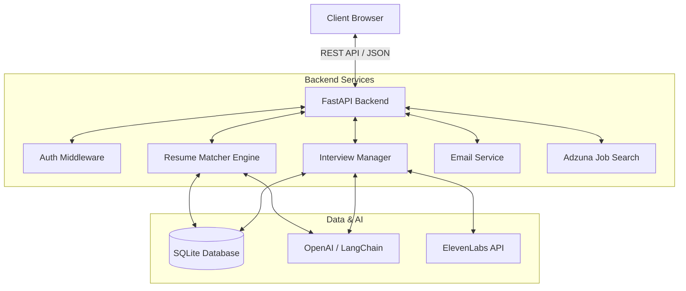
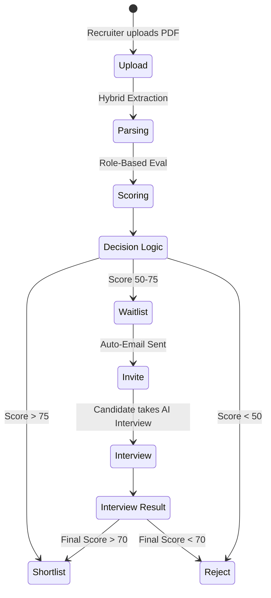
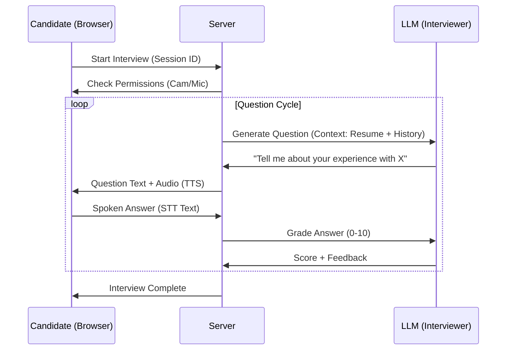

# Resume Matcher & AI Interviewer - Project Documentation

## 1. Project Overview
**Resume Matcher & AI Interviewer** is an advanced recruitment automation platform designed to streamline the hiring process. It uses Large Language Models (LLMs) to intelligently parse resumes, match them against job descriptions, and conduct automated, voice-enabled technical interviews.

### Core Capabilities
- **Intelligent Resume Parsing**: key details (Skills, Experience, Education) are extracted using a hybrid approach (Regex + LLM).
- **Context-Aware Scoring**: Candidates are scored based on role-specific templates (Intern vs Senior), not just keyword matching.
- **AI-Driven Interviews**: Candidates meeting a specific threshold are invited to a real-time, voice-enabled technical interview conducted by an AI agent.
- **Anti-Cheating System**: Fullscreen enforcement, tab-switch monitoring, and webcam integration for interview integrity.
- **Automated Communication**: The system handles the entire email lifecycle—sending invites, rejection letters, or shortlist notifications automatically.

---

## 2. System Architecture & Subsystems

The system is designed as a modular **Agentic Workflow** pipeline. It is not just a monolith but a collection of specialized subsystems that interact via the `FastAPI` orchestrator.

### 2.1 High-Level Architecture
The application is built on a **FastAPI** backend with a **Vanilla JS** frontend, using **SQLite** for persistence and **LangChain** for orchestration.

### 2.2 Module Reference
The codebase is organized into functional domains:
- **`app/matcher.py`**: The *Resume Analysis Engine*. Handles extraction, embedding generation, and mathematical scoring.
- **`app/interview_manager.py`**: The *Interview State Machine*. Manages session context, conversation history, and real-time grading.
- **`app/llm.py` & `prompts.py`**: The *Cognitive Layer*. Centralized interface for OpenAI/LangChain and prompt templates.
- **`app/tts.py`**: The *Voice Synthesis Interface*. Handles streaming audio from ElevenLabs.

---

### 2.3 Subsystem 1: The Resume Matcher (Mini-Project)
This subsystem acts as the "Gatekeeper", filtering candidates before human or AI interaction.
- **Input**:
  - Candidate Resume (PDF/Text)
  - Job Description (Text)
- **Processing Logic**:
  1.  **Extraction**: The `resume_parser.py` module uses a hybrid approach (Regex for contact info, LLM for complex history) to structure the data.
  2.  **Validation**: Extracted skills are cross-referenced with the raw text using strict word-boundary regex to eliminate "hallucinations".
  3.  **Vector Match**: Both documents are embedded into dense vectors (text-embedding-3-small) to calculate Cosine Similarity.
- **Output**:
  - `Match Score` (0-100)
  - `Structured Profile` (JSON)
  - `Gap Analysis` (Missing Skills)

### 2.4 Subsystem 2: The AI Interviewer (Mini-Project)
This subsystem acts as the "Technical Recruiter", conducting behavioral and technical screens.
- **Input**:
  - Candidate Profile (from Matcher)
  - Detection Role (e.g., "Senior Python Engineer")
- **Processing Logic**:
  1.  **Role Deduction**: The system first analyzes the JD to understand *what* it is interviewing for.
  2.  **Contextual Questioning**: Using `InterviewManager`, it generates questions based on previous answers and resume gaps.
  3.  **Real-Time Grading**: Every answer is evaluated against a hidden "Ideal Answer" rubric for Relevance, Correctness, and Depth.
- **Output**:
  - `Interview Score` (0-100)
  - `Transcript` (Q&A Log)
  - `Behavioral Flags` (e.g., frequent tab switching)

---

## 3. Process Engine: Scoring & Ranking

The "Brain" of the application relies on deterministic mathematical models to ensure fairness.

### 3.1 The Scoring Engine
The system uses a **multi-stage scoring algorithm** to ensure high-quality candidate filtering.

#### Stage 1: The Match Score (Resume vs JD)
Upon upload, the resume is compared to the Job Description (JD).
**Formula:**
$$ Final\ Match\ Score = (Skill\ Score \times 60\%) + (Semantic\ Score \times 40\%) $$

- **Skill Score**: Calculated by extracting skills from both documents and finding the intersection.
- **Semantic Score**: Uses vector embeddings (Cosine Similarity) to understand the "vibe" and implicit context match.

#### Stage 2: Role-Based Evaluation
The system detects the role type (Intern, Junior, Senior) and applies a specific **template** to weight different aspects of the resume.

| Parameter | Intern Weight | Junior Weight | Senior Weight |
| :--- | :--- | :--- | :--- |
| **Education** | 25% | 15% | 5% |
| **Experience** | 10% | 25% | 40% |
| **Skills** | 30% | 30% | 35% |
| **Projects** | 25% | 20% | 15% |
| **Certifications** | 10% | 10% | 5% |

*Rationale:* Interns are judged on potential (Education/Projects), while Seniors are judged on track record (Experience).

#### Stage 3: The AI Interview Score
During the interview, every answer is graded on a scale of 0-10 based on relevance, technical accuracy, and depth.
$$ Interview\ Score = Average(Question\ Scores) \times 10 $$

#### Stage 4: Final Candidate Score
The leaderboard ranks candidates by a composite score that favors valid interview performance.
**Formula:**
$$ Final\ Score = (Resume\ Match\ Score \times 40\%) + (Interview\ Score \times 60\%) $$

### 3.2 The Ranking & Classification Engine
Candidates are automatically categorized based on their Final Score.
- **Expert System Logic**:
  - **Score > 75 (Top Tier)**: -> **Auto-Shortlist**. The system tags these as "High Priority".
  - **Score 50 - 75 (Mid Tier)**: -> **Waitlist/Interview**. The system flags these for a mandatory AI Interview to verify skills.
  - **Score < 50 (Low Tier)**: -> **Auto-Reject**. The system filters these out to save time.

---

## 4. AI Engine Internals

The system employs a **Retrieval-Augmented Generation (RAG)** pattern combined with **Chain-of-Thought (CoT)** prompting.

- **Prediction System**: Uses the `detect_job_role` chain to predict the most likely job title and seniority level from a raw JD text.
- **Recommendation System**: The `evaluate_resume_structured` function acts as a recommender, outputting a binary `interview_required` signal based on the weighted parameter analysis.
- **Expert System**: The Interviewer Persona uses a specialized System Prompt (`INTERVIEW_SYSTEM_PROMPT`) that enforces a specific personality (professional, inquisitive, fair) and prevents it from being "jailbroken" into ignoring its instructions.

---

## 5. Workflows

### A. Recruitment Funnel (Recruiter View)
The automated workflow moves candidates through statuses based on their scores.

### B. The Interview Loop (Candidate View)
The candidate experience is designed to mimic a real technical screen.

---

## 6. Key Features Detailed

### 🗣️ Text-to-Speech (TTS) Engine
- **Provider**: ElevenLabs (Primary), Browser Native (Fallback).
- **Voice Selection**: Automatically selects professional voices ('Adam', 'Josh', 'Rachel') if available.
- **Optimization**: Streams audio chunks for low latency.

### 🛡️ Anti-Cheating Suite
- **Visibility Detection**: The interview auto-terminates if the user switches tabs or minimizes the window.
- **Fullscreen Enforcement**: Candidates must remain in fullscreen mode.
- **Device Checks**: Mandatory webcam and microphone checks before starting.

### 📧 Email Notification Service
Powered by SMTP (Gmail), the system sends transactional emails based on status changes:
1.  **"Invited"**: Contains a unique link with a session token for the AI interview.
2.  **"Shortlisted"**: A congratulatory next-steps email.
3.  **"Rejected"**: A polite "thank you" email.

---

## 7. Database Schema (Schema Reference)

The system uses a relational model with JSON fields for flexibility.

**Table: `candidates`**
| Column | Type | Description |
| :--- | :--- | :--- |
| `id` | UUID | Primary Key |
| `name` | TEXT | Extracted filename/name |
| `match_score` | REAL | Initial Resume Score |
| `status` | TEXT | Current State (Matched, Invited, Shortlisted) |
| `matched_skills` | JSON | List of skills found in resume AND JD |
| `flags` | JSON | List of integrity violations (tab switches) |

**Table: `interview_sessions`**
| Column | Type | Description |
| :--- | :--- | :--- |
| `session_id` | UUID | Primary Key (Linked to Candidate) |
| `scores` | JSON | Array of question-by-question grades |
| `current_question` | TEXT | State recovery for page reloads |

---

## 8. API Reference

| Endpoint | Method | Description |
| :--- | :--- | :--- |
| `/upload` | POST | Uploads resumes and JD. Returns initial scores. |
| `/interview/start` | POST | Initializes a session. Returns the first question. |
| `/interview/answer` | POST | Submits an answer. Returns grading and next question. |
| `/interview/speak` | POST | Streams TTS audio for the given text. |
| `/invite/candidate/{id}` | POST | Triggers the email invite workflow. |
| `/interview/terminate` | POST | Ends interview due to cheating/violation. |
