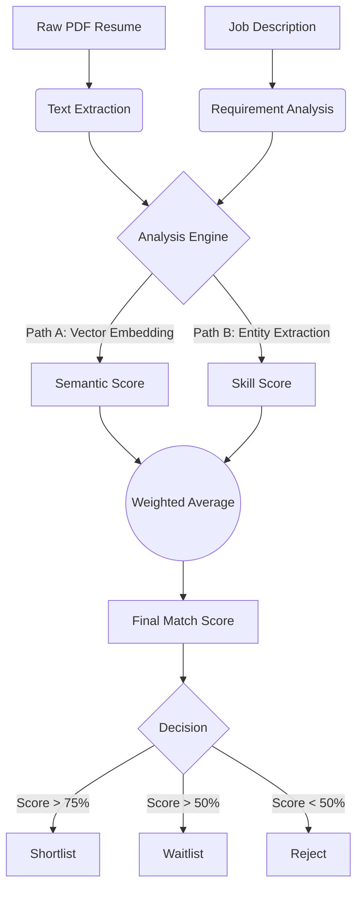
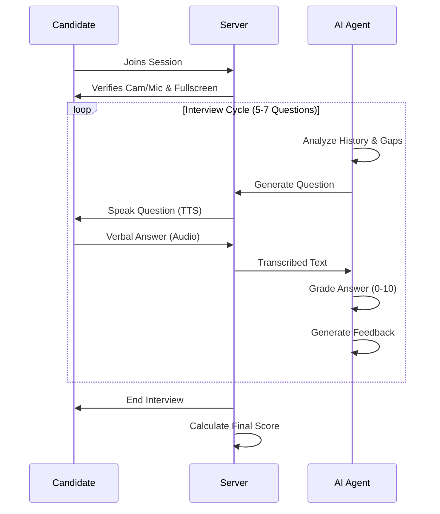
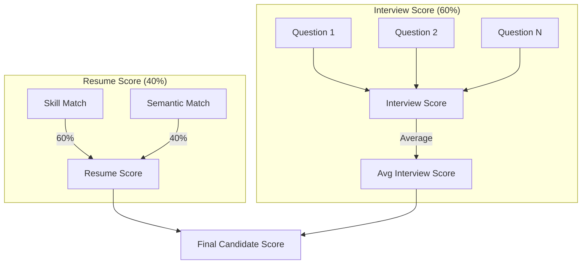
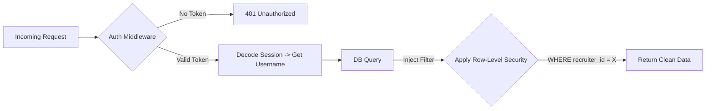

# Virex - AI Resume Parser and Role Matcher (Enterprise Edition)

**Version:** 1.0 (Stable)  
**Last Updated:** 2026-01-19  

---

## 1. Executive Summary

**Virex** is an enterprise-grade **AI-Powered Recruitment & Assessment Platform** designed to solve the "Time-to-Hire" and "Quality-of-Hire" crisis. It automates the traditional recruitment funnel using a multi-agent system. The system automates the preliminary screening process, allowing recruiters to focus only on pre-vetted, high-quality candidates.

### 1.1 High-Level Workflow
The following diagram illustrates the end-to-end journey from a recruiter uploading a job description to a candidate completing an AI interview.


graph LR
    R[Recruiter] -->|Uploads JD & Resumes| IRM[Intelligent Matcher]
    IRM -->|Filters & Ranks| List[Shortlisted Candidates]
    List -->|Auto-Invite| AVI[AI Interviewer]
    AVI -->|Conducts Interview| C[Candidate]
    AVI -->|Grades & Reports| Dashboard[Recruiter Dashboard]


### 1.2 Core Value Proposition
- **Efficiency**: Reduces screening time by 90% using automated parsing.
- **Fairness**: Removes human bias via deterministic scoring algorithms.
- **Scalability**: Capable of interviewing hundreds of candidates simultaneously 24/7.

---

## 2. System Architecture

The system follows a **Modular Monolithic Architecture** (Microservices-Ready), ensuring strict separation of concerns between the backend, frontend, and data processing layers. This design allows for independent scaling of the heavy AI processing nodes if needed in the future.

### 2.1 Technical Stack & Component Interaction

| Layer | Technology | Description |
| :--- | :--- | :--- |
| **Frontend** | **Next.js 14** | Server-Side Rendering (SSR) for SEO and performance. |
| **Backend** | **FastAPI** | Async Python API handling requests and orchestration. |
| **Database** | **PostgreSQL/SQLite** | Relational storage for candidates, sessions, and logs. |
| **AI Layer** | **LangChain** | Manages LLM context, prompt chaining, and memory. |


graph TD
    Client[Client Browser] <-->|HTTPS / JSON| NEXT[Next.js Frontend]
    NEXT <-->|REST API| API[FastAPI Backend]
    
    subgraph "Backend Services"
        API <--> Auth[Auth Middleware]
        API <--> Matcher[Resume Matcher Engine]
        API <--> Interview[Interview Manager]
        API <--> Queue[Background Worker]
    end
    
    subgraph "Data Persistence"
        Matcher <--> DB[(Database)]
        Interview <--> DB
    end
    
    subgraph "External AI Services"
        Matcher <--> |Embeddings| OpenAI[OpenAI API]
        Interview <--> |TTS/STT| ElevenLabs[ElevenLabs API]
    end
```

---

## 3. Sub-System I: Intelligent Resume Matcher (IRM)

The IRM acts as the "Gatekeeper". It is responsible for ingesting unstructured data (PDFs), converting it into structured entities, and comparing it against the Job Description (JD).

### 3.1 The Process Flow
The matching process is not a simple keyword search. It involves a sophisticated multi-step pipeline that combines semantic understanding with rigid requirement checking.

1.  **Ingestion**: Files are uploaded and text is extracted using OCR/PDF miners.
2.  **Hybrid Extraction**:
    *   **LLM Extraction**: For complex fields like "Project History" or "Soft Skills".
    *   **Regex Validation**: For rigid fields like "Email", "Phone", and specific technical keywords to prevent hallucination.
3.  **Scoring**: The candidate is scored on two axes (Semantic vs. Skill).



### 3.2 Categorization Logic
The system automatically sorts candidates into buckets based on the **Final Match Score**.
-   **Shortlist (> 75%)**: High priority. System suggests immediate interview.
-   **Waitlist (50-75%)**: Potential matches. Flagged for review.
-   **Reject (< 50%)**: Does not meet minimum requirements.

---

## 4. Sub-System II: Adaptive Virtual Interviewer (AVI)

The AVI is a "Context-Aware" AI Recruiter capable of conducting structured, cheat-proof technical screens. Unlike a static form, it asks follow-up questions and "probes" the candidate's knowledge.

### 4.1 Interview State Machine
The interview is modeled as a Finite State Machine (FSM). The AI maintains conversation history and adapts its next question based on the previous answer and the initial resume gaps.



### 4.2 Grading Rubric
Every answer is graded in real-time on three criteria:
1.  **Relevance**: Did they answer the specific question asked?
2.  **Depth**: Did they demonstrate superficial or deep understanding?
3.  **Clarity**: Was the communication clear and professional?

---

## 5. Scoring & Ranking Logic

The system uses a transparent, deterministic mathematical model to rank candidates. This ensures that the ranking is defensible and free from "AI Black Box" mystery.

### 5.1 The "Golden Hybrid" Formula
The final ranking depends on a weighted combination of the Resume Match and the Interview Performance.



**Formula**:
$$ Final Score = (Resume Score \times 0.40) + (Interview Score \times 0.60) $$
*Note: The interview is weighted higher because verifiable skills are more important than claimed skills.*

---

## 6. Security, Isolation & Compliance

Security is paramount in recruitment systems handling PII (Personally Identifiable Information). Virex implements strict data isolation at the database level.

### 6.1 Recruiter Data Isolation
The system ensures that `Recruiter A` clearly sees only their candidates, even if `Recruiter B` is using the system simultaneously. This is enforced via Foreign Key constraints and middleware intercepts.



### 6.2 Anti-Cheating Mechanisms
-   **Tab-Switch Detection**: JavaScript Event Listeners (`visibilitychange`) monitor if the user leaves the tab.
-   **Fullscreen Enforcement**: The `document.fullscreenElement` API ensures the candidate cannot Google answers on the same screen.
-   **Session Locking**: Once an interview is completed or terminated for cheating, the session token is invalidated permanently.

---

## 7. API Reference & Integration Points

The backend exposes a RESTful API documented via Swagger/OpenAPI.

```mermaid
classDiagram
    class CandidateAPI {
        +POST /upload()
        +GET /leaderboard()
        +GET /candidate/{id}()
    }
    
    class InterviewAPI {
        +POST /interview/start()
        +POST /interview/answer()
        +POST /interview/terminate()
    }
    
    class AuthAPI {
        +POST /auth/login()
        +POST /auth/logout()
    }
    
    CandidateAPI ..> AuthAPI : Requires Session
    InterviewAPI ..> CandidateAPI : Links to Candidate
```

### Key Endpoints
| Endpoint | Method | Function |
| :--- | :--- | :--- |
| `/auth/login` | POST | Authenticates recruiter and issues session token. |
| `/upload` | POST | Bulk upload of resumes + JD. Triggers async processing. |
| `/leaderboard` | GET | Returns ranked list of candidates for the logged-in recruiter. |
| `/interview/start` | GET | Initializes interview session (Candidate side). |
| `/interview/answer` | POST | Submits audio/text answer; returns AI grade & next question. |

---

*Copyright © 2026 Virex Systems. All Rights Reserved.*
