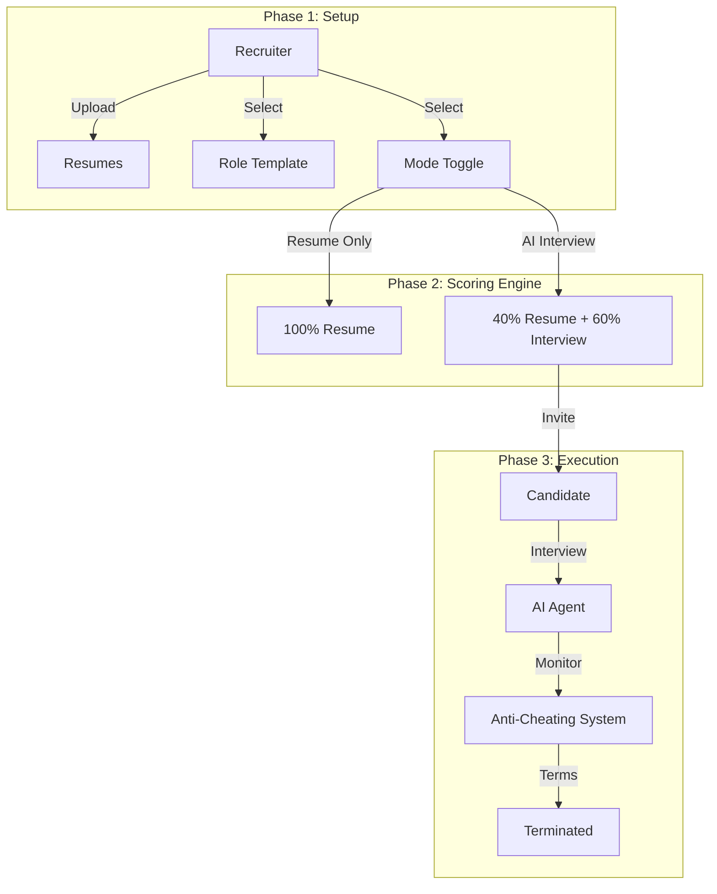

# Project Report: Virex Resume Matcher & AI Interviewer

**Project:** Virex-Smart Resume Matcher & AI Interviewer
**Date:** January 22, 2026
**Version:** 1.0

---

## 1. Executive Summary

The **AI-Powered Recruitment & Interview Automation System** is a next-generation hiring platform designed to solve the bottlenecks of high-volume recruitment. By integrating **Large Language Models (LLMs)**, **Vector Embeddings**, and **Autonomous Voice Agents**, the system unifies the traditionally fragmented stages of resume screening and technical interviewing into a single, seamless pipeline.

This report details the complete, code-verified system which operates in three distinct phases: **Setup (Recruiter)**, **Scoring & Mode Selection**, and **Execution (Interview & Anti-Cheating)**. The system transforms recruitment from a manual process into a data-driven science.

---

## 2. Problem Statement & Solution Architecture

### 2.1 Problem Statement
In the modern recruitment landscape, Human Resources (HR) departments face critical challenges:
1.  **High Volume Saturation**: A single job posting attracts hundreds of resumes. Manually reviewing these takes an average of 40+ hours per role.
2.  **Human Bias**: Manual screening is susceptible to unconscious biases.
3.  **Inefficiency**: Scheduling and conducting preliminary 15-30 minute calls is a major bottleneck.
4.  **Integrity**: Ensuring the authenticity of remote candidates is difficult without advanced monitoring.

### 2.2 Solution Architecture: The 3-Phase Standard Workflow
Our solution acts as a "Digital Recruiter" following a strict operational flow:

#### **Phase 1: Recruitment Setup**
*   **Action**: The recruiter uploads Resumes (PDFs) and the Job Description (JD).
*   **Template Selection**: The system either **Auto-Selects** a Role Template (e.g., "Junior Template" vs "Senior Template") using AI or allows manual selection.
*   **Mode Selection**: The recruiter toggles between **"Resume Only Mode"** (Fast) or **"AI Interviewer Mode"** (Deep Vetting).

#### **Phase 2: Hybrid Scoring Calculation**
The system applies specific formulas based on the selected mode:
*   **Scenario A: AI Interviewer Mode (Selected)**
    *   **Total Score** = 40% Resume Score + 60% Interview Score.
    *   *Logic*: Prioritizes verified verbal performance over written claims.
*   **Scenario B: Resume Only Mode**
    *   **Total Score** = 100% Resume Score.
    *   *Logic*: Used for rapid bulk filtering where interviews are not required.

#### **Phase 3: Execution (The AI Interview)**
*   **Access**: Shortlisted candidates receive a unique interview link via email.
*   **Security**: The system enforces an **Anti-Cheating Protocol**.
    *   **Detection**: Monitors Fullscreen exits and Tab Switches.
    *   **Consequence**: If cheating is found (2+ Flags), the candidate is **Marked Terminated** immediatey.

---

## 3. Comprehensive System Architecture

### 3.1 High-Level Component Diagram
The system connects three main layers: The Client (User Experience), The API (Logic), and The Intelligence (AI Services).

### 3.2 Data Flow Architecture
1.  **Ingestion Flow**: Resume PDF $\rightarrow$ Text Extraction $\rightarrow$ LLM Template Mapping $\rightarrow$ Initial Score.
2.  **Interview Flow**: Voice Audio $\rightarrow$ STT $\rightarrow$ LLM Context Engine $\rightarrow$ TTS $\rightarrow$ Browser Audio.
3.  **State Management**: Redis manages the active "Session State" to ensure the interview context is preserved in real-time.

---

## 4. Sub-System I: The Intelligent Resume Matcher (IRM)

### 4.1 Evaluation System: Structured Candidate Profiling
The heart of the Matcher is its deep evaluation logic, which goes beyond keywords.

1.  **Information Extraction**: The LLM extracts a **Structured Candidate Profile** containing distinct parameters:
    *   *Work Experience*
    *   *Education*
    *   *Skills*
    *   *Projects*
    *   *Certifications*
2.  **Likert Scale Scoring**:
    *   Each parameter is evaluated on a **1-5 Likert Scale** (e.g., "5/5" for Exceptional Projects).
    *   The system uses the **Role Weightage** selected in Phase 1 (according to the JD) to calculate the final weighted sum.
    *   *Example*: A "Senior" role weights Experience (45%) higher than Education (10%).

### 4.2 Process Engine: Hybrid Matching
*   **Explicit Skill Match**: Counts exact hard skill matches (e.g., "Python").
*   **Semantic Similarity**: Uses Vector Embeddings to judge the context/vibe match.

### 4.3 Output Layer
*   **Resume Score (0-100)**: The calculated output from the Likert evaluation.
*   **Status**: Candidates scoring $\ge 50\%$ are Shortlisted.

---

## 5. Sub-System II: The Adaptive Virtual Interviewer (AVI)

### 5.1 Objective & Scope
The AVI acts as a "Proxy Technical Interviewer". It validates that the candidate *actually knows* what they claim on their resume through a dynamic, 5-question oral exam.

### 5.2 Input Layer: Real-Time Audio
*   **Audio**: Uses the browser's `Web Speech API` for native, low-latency Speech-to-Text.
*   **Context**: The AI is fed the Candidate's Resume, the match score, and the JD to generate context-aware questions.

### 5.3 Process Engine: The Cognitive Agent
The "Agent" operates in the **Listen-Think-Speak** loop:
1.  **User Input**: "I used React Context."
2.  **Reasoning**: "Ask a follow-up on performance implications."
3.  **Grading**: A separate Grader Agent scores the answer (0-10).
4.  **Speak**: Text converted to Audio via ElevenLabs.

### 5.4 Output Layer: Psychometric Profiling
Every answer is graded on a **Strict 0-10 Rubric**:
*   *9-10 (Exceptional)*: Deep theoretical understanding.
*   *7-8 (Good)*: Technically correct.
*   *0-4 (Poor/Fail)*: Incorrect or hallucinated.

---

## 6. Sub-System III: The Scalability & Asynchronous Core

### 6.1 Parallel Processing Architecture
To handle enterprise-level loads (e.g., 500 applicants), the system relies on **Asynchronous Workers**.
*   **Resume Parsing**: Background threads process PDFs in parallel.
*   **Redis Hot-State**: Active interview sessions are stored in Redis for <10ms latency.

### 6.2 Database Schema
The system uses a relational schema with Foreign Key constraints to ensure data integrity.
*   **Candidate**: Stores Profile, Scores, Flags, and Status.
*   **InterviewSession**: Stores active session state and transcript logs.
*   **Recruiter**: Handles Auth and Session tokens.

---

## 7. Technology Stack & Implementation Details

| Component | Technical Choice | Implementation Note |
| :--- | :--- | :--- |
| **Framework** | **FastAPI** | Native async/await support. |
| **Frontend** | **Next.js 14** | React Server Components. |
| **LLM** | **LangChain** | Orchestrates "Chain of Thought". |
| **Vector DB** | **FAISS (Local)** | In-memory semantic search. |
| **Cache** | **Redis** | Critical for session management. |
| **TTS** | **ElevenLabs** | Realistic voice interface. |

---

## 8. Security & Compliance

### 8.1 Anti-Cheating Protocol (Phase 3 Execution)
The system implements a **Zero-Trust Exam Environment** during the interview.

1.  **Singleton Device Lock**: Strict cookie validation ensures only one device can access the session.
2.  **Active Monitoring**:
    *   **Fullscreen Check**: Exiting fullscreen triggers a Flag.
    *   **Tab Focus Check**: Switching tabs triggers a Flag.
3.  **Termination Logic**:
    *   **1 Flag**: Warning (20% Score Deduction).
    *   **2+ Flags**: **Session Terminated** (Score = 0).

---

## 9. Conclusion & Future Roadmap

### Conclusion
The **AI-Powered Recruitment System** successfully transforms the hiring process. By strictly following the **3-Phase Workflow**—from intelligent Resume Scoring (Phase 1 & 2) to rigorous AI Interviewing (Phase 3)—the system ensures fairness, efficiency, and integrity.

### Future Roadmap
1.  **Code Execution Sandbox**: Integrate a live coding environment.
2.  **Multimodal Emotion Analysis**: Analyze non-verbal confidence cues.
3.  **ATS Integration**: Direct API connectors for Greenhouse/Workday.
