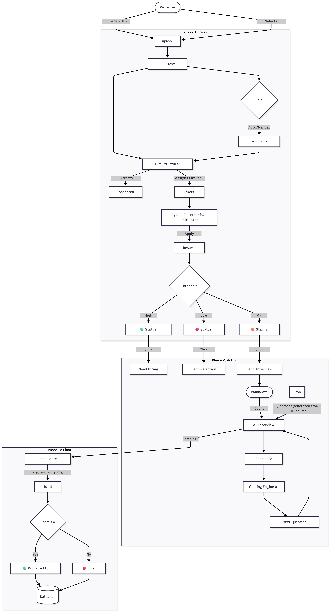

# 🧠 Virex AI - Intelligent Recruitment & Interview Platform

**Virex AI** is a comprehensive recruitment automation system that standardizes the hiring process. It replaces subjective resume screening with a deterministic, template-based evaluation engine and an adaptive AI interviewer.

## 🌟 Key Features

### 1. 🔍 Structured "Virex" Resume Evaluation
*   **Zero-Hallucination Parsing**: Uses direct LLM evidence extraction to find skills, education, and experience, strictly verified against the text.
*   **Role-Specific Templates**: Scoring is not generic. Recruiters can select templates (or let the AI Auto-Detect):
    *   **🎓 Intern/Fresher**: High weight on Education (25%) and Projects (25%).
    *   **👨‍💻 Junior/Mid**: Balanced profile (Skills 30%, Experience 25%).
    *   **🚀 Senior/Lead**: high weight on Experience (40%) and Leadership.
*   **Likert Scale Scoring**: Every resume is evaluated on 5 axes (Education, Experience, Skills, Projects, Certifications) using a 1-5 Likert scale, providing granular and explainable scores.

### 2. ⚡ Automated Decision Workflow
*   **Smart Thresholds**: The system automatically buckets candidates based on their Weighted Score:
    *   **🟢 Shortlisted**: Immediate "Next Round" hiring action.
    *   **🟠 Waitlisted**: Borderline candidates invited to an automated AI Interview to prove themselves.
    *   **🔴 Rejected**: Candidates below the minimum cutoff.
*   **One-Click Actions**: The Leaderboard buttons dynamically change based on status ("Invite", "Next Round", "Send Rejection").

### 3. 🤖 Adaptive AI Interviewer
*   **Context-Aware**: The AI interviewer reads the specific Job Description and the Candidate's Resume before starting.
*   **Dynamic Questioning**: Follow-up questions are generated in real-time based on the candidate's previous answer.
*   **Dynamic Promotion**:
    *   Waitlisted candidates who perform well in the interview (Score > 70%) are **automatically promoted** to "Shortlisted" status.
    *   Final Score = **40% Resume Match + 60% Interview Performance**.

### 4. 📊 Detailed Analytics & Reporting
*   **Explanations**: Every score comes with a "Reasoning" text explaining exactly why a candidate received that score.
*   **Transcript Recording**: Full chat transcripts of the AI interview are saved.
*   **Skill Gap Analysis**: Visualizes exactly which required skills are matched and which are missing.

---

## 📐 System Architecture & Process Flow




---

## 🛠️ Technology Stack

| Component | Technology | Usage |
| :--- | :--- | :--- |
| **Backend** | `FastAPI` (Python) | Async web server, handling parallel LLM requests and WebSocket-like flows. |
| **Evaluation** | `LangChain` + `Pydantic` | Structured output parsing for strict JSON data enforcement. |
| **Frontend** | `Vanilla JS` + `HTML5` | Responsive, no-build UI with real-time updates. |
| **Database** | `SQLite` | Persistent storage for Candidates, Sessions, and Transcripts. |
| **AI Models** | `GPT-4o-mini` | Powers the reasoning, resume parsing, and interview generation. |
| **TTS (Voice)** | `ElevenLabs` / Browser | Text-to-Speech for realistic interview experience. |

---

## 🚀 Installation & Setup

1.  **Clone the Repository**
    ```bash
    git clone https://github.com/your-repo/virex-ai.git
    cd virex-ai
    ```

2.  **Install Dependencies**
    ```bash
    pip install -r requirements.txt
    ```

3.  **Configure Environment**
    Create a `.env` file:
    ```ini
    OPENAI_API_KEY=sk-your-key
    OPENROUTER_API_KEY=sk-your-openrouter-key
    # Optional for Email
    SMTP_USERNAME=your-email@gmail.com
    SMTP_PASSWORD=your-app-password
    ```

4.  **Run the Server**
    ```bash
    uvicorn app.main:app --reload
    ```

5.  **Access the Dashboard**
    *   Login: `admin` / `admin123`
    *   URL: [http://127.0.0.1:8000/](http://127.0.0.1:8000/)
